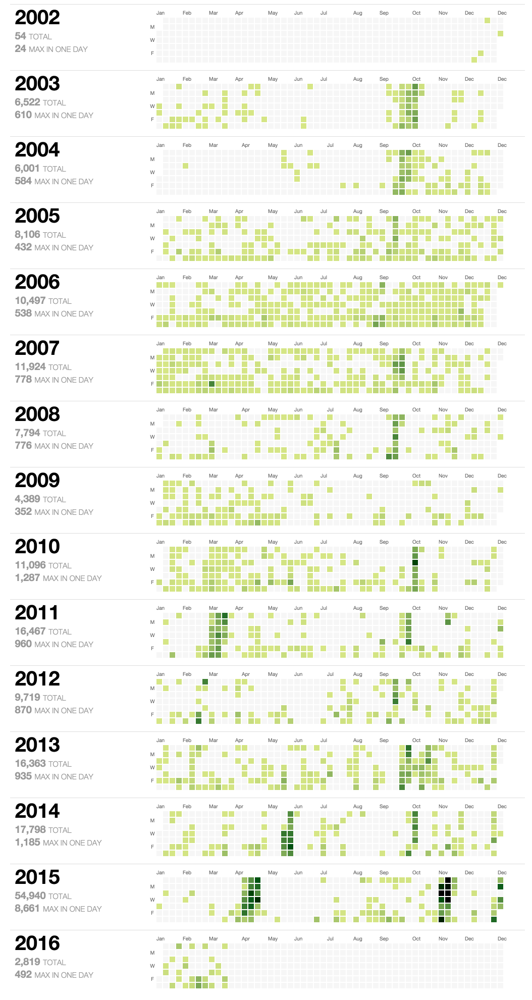

This is a quick proof of concept that renders yearly heatmaps of my
photo taking activity by day, with statistics extracted from my
Lightroom catalogs with my
[luminosity](https://github.com/aalpern/luminosity) go
library. Heatmaps are rendered with
[my fork](https://github.com/aalpern/calendar-heatmap) of
[DKirwan/calendar-heatmap](https://github.com/DKirwan/calendar-heatmap).

